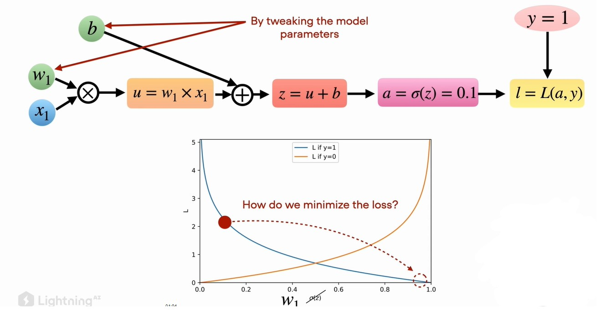
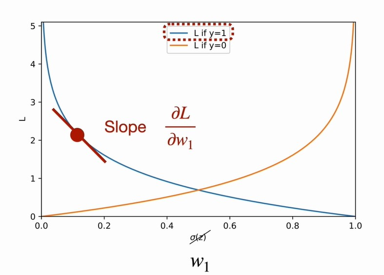
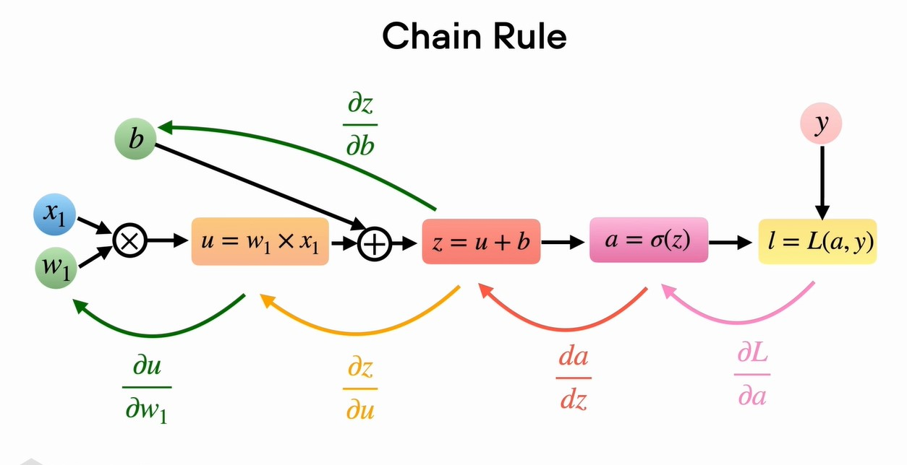
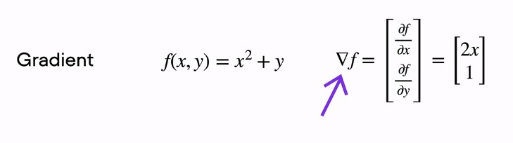

# Stochastic Gradient Descent

### Some Prerequisite Notes

Here is the general idea how the training of neural network works. 1st we pass inputs through the neural nets we calculate weighted sum then pass it to activation function and finally we calculate loss using the loss function. And based on the derivation of loss function with respect to parameters of the NN we get gradient or slope and based on that value we update the parameter values to optimal values. And optimal parameters will minimize the loss.



In above example we want to update `w1` and `b` parameters. We want to move loss value to right side that is minimum. and to move this we use concept from `calculus` where we calculate the slope of the currunt loss point at this curve.

So, computing `partial derivative` with respect to `w1`.


> CRUX: is to update a model parameters such that it can results in minimum loss.

**The Chain Rule**

So, computing the partial derivative of the loss with respect to parameter w1 involves the chain rule.

The chain rule is the tool to compute the partial derivatives for the nested function.

So if we want to compute partial derivative of the `loss` WRT `w1`, we can use the chain rule to break it down in individual steps then we can combine.



> 💡 Note: We don't need to compute these partial derivatives ourself PyTorch will take care of that.

## Relation between Derivative and Gradients.

The ultimate goal is to train the Logistic Regression model and for that we're going to use the algorithm called Stochastic Gradient Descent

**Partial Derivative:** Is the derivative of one of the variables if function consists of more than one variable.

$$ Partial Derivative f(x, y) = x^2 + y$$

So, here is the partial derivative of `f` with respect to variable `x` which is `2x`.
$$ \frac{\partial f}{\partial x} = 2x$$

And now there's a second variable `y` and can also compute partial derivative of `f` with respect to `y` and in this case its `1`
$$ \frac{\partial f}{\partial y} = 1$$

We use partial derivative when we have a multiple variables and we want to compute individial partial derivatives.

**How this is related to the gradient of a function?**

So, the gradient is just an way of writting down these partial derivatives in a vector form.



So, how does this relate to logistic regression, here we have multiple parameters to update weight parameter `w1` and bias parameter `b`. We have 2 partial derivative of loss function. And gradient of this loss will be 2 partial derivative in vector form.

So now we can define the training method to minimize the loss.

# Gradient Descent Algorithm

- its an iterative process, let's see its working.

```
For each training epoch:
    overall_loss L = 0
    For each training example:
        output = get_result_from_model()
        overall_loss L = overall_loss L +
```
