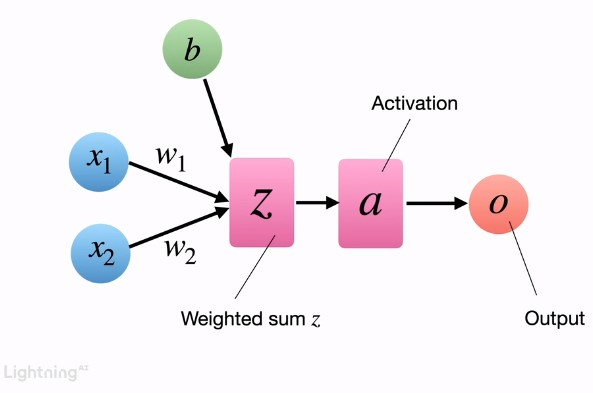

# Notes

### Aim

Building logistic regression model using pytorch. Then training algorithm
behind NN, Also PyTorch Automatic deferenciation engine, training a model efficiently

## Logistic Regression

- It is having similarity with the perceptron.
- Both are single layer NN.
- In regression there will be a countinues value as output. However, logistic regression is the classification model, specifically binary classification. As classification model will give class values.

